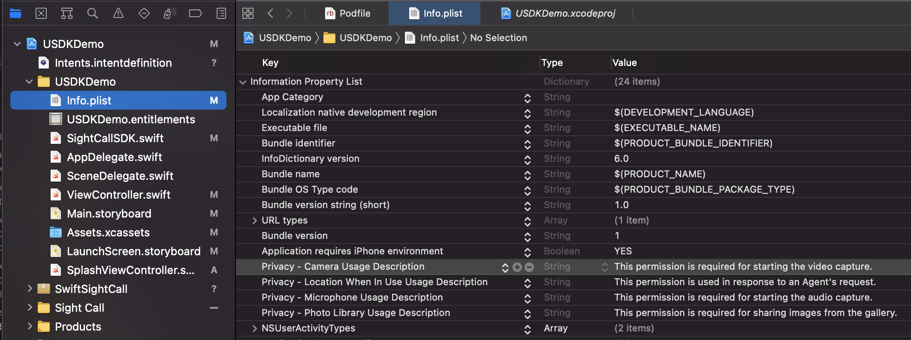
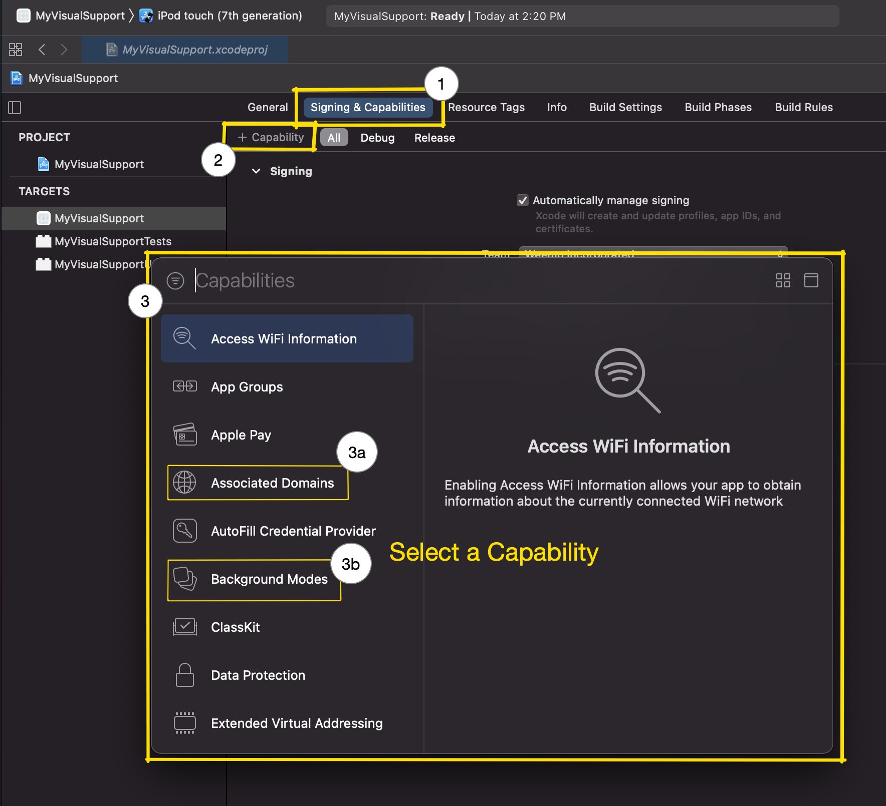
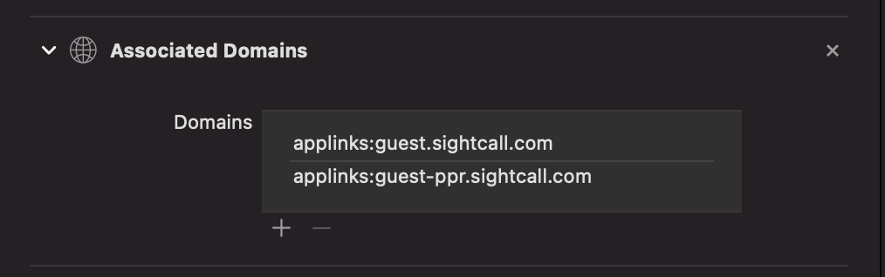
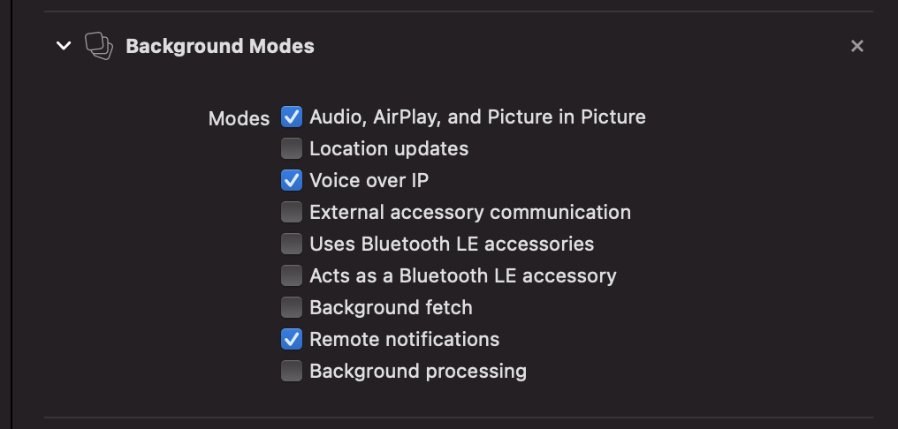

# SightCall iOS SDK

This SDK is provided for Sightcall customers. It is designed to be integrated into your existing app flow and bring seamless access to the Sightcall experience.

> NOTE: To fully utilize this SDK you must be a registered client with SightCall.
>

## Overview

SightCall makes it easy for a user in the field to communicate and share video with a remote company agent. Typically the agent will direct the experience manipulating camera controls using Augmented Reality overlays and a visual markers to assist the user in their task.

The SightCallSDK is designed to enable you, the developer, to easily integrate this capability into your applications.

## Account Setup

> NOTE: Apple's Safari Browser is NOT currently supported, use Firefox or Chrome instead and install the SightCall browser plugin as directed.
>

#### SightCall Account

To use the SDK you must first set up your account with SightCall. Refer to the detailed documentation on fully managing your account but for this example these are the essential steps.

Log into https://admin.sightcall.com/ and create a `agent user` and `use case`.

- Admin: TENANT: Users: Desktop Agents
- Admin: TENANT: Use Cases: Use Cases CODE
  - Use Case Name: "Show Me"
  - Code Options: all
  - Pin code page: No
  - Code auto deleted: No

#### SightCall Session Invitation URL

A SightCall invitation URL is generated by the Agent and sent to the user by email or SMS. If the PIN is not included with the URL (as set by the `Pin code page` option) then it must be transimitted to the user by other means.

TODO: Visual aid

```
// NO Pin
// https://<your.domain>/call/<sight_call_use_case_id>
https://guest.sightcall.com/call/b7cdc700d817ddf86f143675340d0f7a15b461010

// Pin Included
// https://<your.domain>/call/<sight_call_use_case_id>?pin=<session_id>
https://guest.sightcall.com/call/b7cdc700d817ddf86f143675340d0f7a15b461010?pin=123456
```

> NOTE: Your domain must be properly configured to support Apple Deeplinks for the URL to be handed off to your application. If you are testing using the `guest.sightcall.com` domain then you can use the pasteboard to avoid having to manually enter the URL into your application.
>

## Xcode Project Configuration

### Create an iOS application in Xcode

Either create a new iOS application or grab one of your own.

### Installation with CocoaPods

Using [CocoaPods](https://cocoapods.org/) is the easiest way to get started (if you're new to CocoaPods, check out their [getting started documentation](https://guides.cocoapods.org/using/getting-started.html)). Set up your project to use `cocoapods`. Then integrate the Sightcall sdk into your  project by adding the following framework to your application target in your `Podfile`:

```shell
    pod 'LSUniversalSDK', :git => 'https://github.com/sightcall/iOS-UniversalSDK.git'
```

### Configuration

Once you have created your project you will need to set a number of application settings.

#### Permissions

The Framework requires some permissions to be used and must be set in the App's `Info.plist`. Each of the following options can be typed in or simply scroll down to the `Privacy` settings after adding a new top-level item to the `Information Property List`.

* **NSLocationWhenInUseUsageDescription** This permission is used in response to an Agent's request.

* **NSCameraUsageDescription**This permission is required for starting the video capture. I

* **NSMicrophoneUsageDescription**This permission is required for starting the audio capture. 

* **NSPhotoLibraryUsageDescription** This permission is required for sharing images from the gallery.



#### Capabilities

To fully utilize the SDK you should add `Associated Domains` and `Background Modes` Capabilities.

Start by selecting your application's TARGET. Then select the `Signing & Capabilities` tab (#1) and add a desired capability (#2) and choose it (#3) from the popup. The two of interest are the `Associated Domains` (#3a) and `Background Modes` (#3b).



##### Universal links

To setup your universal links, your domains should be added to the **Associated Domains** section (in Signing and  Capabilities of your target). (Custom URL schemes are no longer recommended due to security concerns. Prefer Universal Links instead)
Common domains are usually: 

* **applinks:guest.sightcall.com**
* **applinks:guest-ppr.sightcall.com**

> Note: Depending on your use case, you may need specific domains. Don't forget to ask your SightCall contact for them.



You can learn more about Universal Links at [Apple: Supporting Universal Links](https://developer.apple.com/documentation/xcode/allowing_apps_and_websites_to_link_to_your_content/supporting_universal_links_in_your_app) and a great tutorial at [Ray Wenderlich: Universal Links: Make the Connection](https://www.raywenderlich.com/library?q=universal+links&sort_order=relevance).

#### Background Modes

If you need to be able to continue the call on background, you should setup the associated section (in Signing and  Capabilities of your target, then **Background Modes**):

* **Audio, AirPlay, and Picture in Picture**
* **Voice over IP**
* **Remote notifications**




### Code Implementation

First, import `LSUniversalSDK`, have your `SceneDelegate` adopt the `SightCallManager` protocol and initialize the `sightCall` variable:

```swift
class SceneDelegate: UIResponder, UIWindowSceneDelegate, SightCallManager {    

    var window: UIWindow?
    var sightCall: SightCallSDK!
...

func scene(_ scene: UIScene, willConnectTo session: UISceneSession, options connectionOptions: UIScene.ConnectionOptions) {
    guard let _ = (scene as? UIWindowScene),
  		    let window = window
    else { return }
    sightCall = SightCallSDK(window: window)
    /**
    **/
}
```

 Add a call to `start:` with the start with a specified URL. This, usually, takes place in SceneDelegate:

```swift
  func scene(_ scene: UIScene, continue userActivity: NSUserActivity) {
      guard let url = userActivity.webpageURL else { return }
      sightCall.start(with: url)
  }

  func scene(_ scene: UIScene, openURLContexts URLContexts: Set<UIOpenURLContext>) {
      guard let url = URLContexts.first?.url else { return }
      sightCall.start(with: url)
  }
```

#### Alternate SightCall Start

As an alternative, you could start up a SightCall session from within any UIViewController through the convenience `sightCall` getter.

``` swift
class ViewController: UIViewController {
    @IBAction
    func activate() {
        if let url_p = UIPasteboard.general.string {
            sightCall?.start(with: url_p)
        }
    }
}
```


### Running a SightCall Session

Unlike messaging and "phone" applications, users and agents are not connected by their unique identifiers (eg. phone number). Rather, a SightCall Session is initiated by "invitation". This invitation is in the form of a URL which is sent from the Agents Console application.

To test your account and use case you can use the Visual Support App which you can download from the App Store.

NOTE: Apple's Safari Browser is NOT currently supported, use Firefox or Chrome instead and install the SigghtCall browser plugin as directed.

#### Steps

- AGENT: Log on to https://console.sightcall.com/host as the `agent user` you created.
- AGENT: `Start` the session (upper right hand menu option) and send an SMS or email to the user.
- USER: Click on the link (or copy it to the pasteboard)
- USER: If using the pasteboard to pass the invitation URL tap on the "Connect" button in the sample application.


